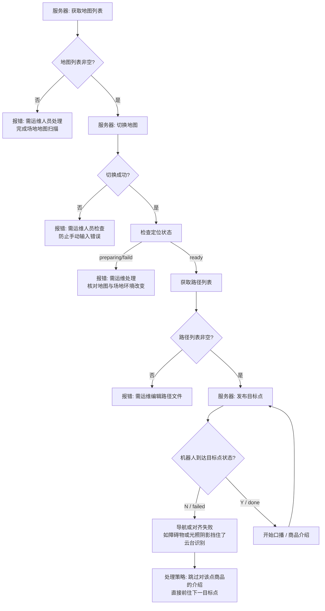

# 直播机器人业务接口需求及通信协议总结

> **数据来源:** [语雀文档 - 直播机器人业务接口需求](https://bingda.yuque.com/staff-hckvzc/md6o1d/be51vryhv9rq20du)  
> **更新时间:** 2026-07-25  

本文档是对冰达 2026 项目研发中《直播机器人业务接口需求》的核心通信协议、接口指令与业务执行流程的全面总结与提炼。

---

## 1. 核心业务交互流程与异常处理 (Workflow & Error Handling)

根据原文档提供的流程图，机器人在直播巡逻与讲解过程中的完整控制流及处理机制如下：



### 关键运维与异常兜底策略
1. **地图/路径列表为空或切换失败**：系统抛出错误，提示运维人员重新扫图、核对实景环境变化或补全 CSV 路径文件。
2. **导航失败 (Navigation Failed)**：目标点不可达（例如途中或终点遭临时纸箱占据），系统记录 `failed` 状态并**自动跳过该点位介绍**。
3. **云台对准失败 (Alignment Failed)**：目标处于视角外、商品不存在或受光照/阴影影响导致未正确识别 COCO 物体时，同样记为 `failed` 并**跳过当前商品介绍**。

---

## 2. 交互协议接口列表 (Server ↔ Robot)

通信接口采用 JSON 指令结构。以下为各大功能模块详细释义：

### 2.1 获取地图列表 (Get Map List)
* **服务器 → 机器人**：获取机器人端存储的所有地图文件名称。"all" 参数在本项目中无实际意义，作为占位符使用。
  ```json
  { "get_map_list": "all" }
  ```
* **机器人 → 服务器**：回复地图文件列表，以字符串数组形式返回机器人中存储的所有地图文件名称。
  ```json
  { "robot_map_list": ["map1", "map2", "map_3"] }
  ```

### 2.2 切换地图 (Switch Map)
* **服务器 → 机器人**：选择当前场地所对应的地图名称，名称需要在地图列表中。
  ```json
  { "set_switch_map": "map1" }
  ```
* **机器人 → 服务器**：回复切换地图命令。
  ```json
  { "robot_switch_map": "true" }
  ```
  > `true`: 地图文件存在；`false`: 地图文件不存在。

### 2.3 获取路径文件列表 (Get Path List)
* **服务器 → 机器人**：获取某一地图下对应的路径文件列表，参数为地图名称。
  ```json
  { "get_path_list": "map_name" }
  ```
* **机器人 → 服务器**：回复路径文件列表，以字符串数组形式返回机器人中存储该地图文件下存在的所有路径文件名称。
  ```json
  { "robot_path_list": ["path1", "path2"] }
  ```

### 2.4 发布目标点 (Publish Goal & Object)
* **服务器 → 机器人**：设置机器人即将前往的目标点及到达目标点后需要对准的物体。
  ```json
  {
    "set_goal": {
      "path_name": "path1",
      "goal_id": 3,
      "goal_object": "car"
    }
  }
  ```
  | 参数名 | 字段解释 |
  | --- | --- |
  | `path_name` | 路径文件名称 |
  | `goal_id` | 路径文件中的第几个点 |
  | `goal_object` | 到达该点后需要对准的物体 |

* **机器人 → 服务器**：回显下发参数，并传回 `goal_check` 校验字段。当校验通过后，机器人将开始移动到目标点。
  ```json
  {
    "robot_goal": {
      "path_file": "path1",
      "goal_id": 3,
      "goal_object": "car",
      "goal_check": "true"
    }
  }
  ```
  > `goal_check`: 校验该路径文件和路径点是否存在，存在为 `true`，不存在为 `false`。

---

## 3. 机器人心跳状态上报 (Robot Heartbeat)

机器人定期上报自身状态（推荐 1Hz/5Hz/10Hz 频率）：

### 3.1 心跳 JSON 示例
```json
{
  "system": {
    "status": "ready",
    "battery": 85
  },
  "map": {
    "mode": "localization",
    "name": "map1",
    "status": "ready"
  },
  "naviagtion": {
    "status": "ready",
    "goal_status": "going"
  },
  "task": {
    "path_file": "path1",
    "goal_id": 1,
    "goal_object": "car",
    "goal_status": "done",
    "object_status": "faild",
    "tast_remain_time": 85
  },
  "gimbal": {
    "record_status": "recording",
    "yaw": 45,
    "pitch": 10,
    "mode": 1
  }
}
```
*(注：原文 JSON 示例中存在部分特殊命名及缩写，如 `naviagtion`、`faild`、`tast_remain_time`，代码解析时需特别注意)*

### 3.2 心跳字段字典
| 顶级分组 | 子属性名 | 枚举值 / 类型 | 说明 |
| --- | --- | --- | --- |
| **system** (整机状态) | `status` | `ready` / `error` | `ready`: 设备硬件工作正常<br>`error`: 设备硬件故障 |
| | `battery` | Integer (`0-100`) | 电池剩余电量百分比 |
| **map** (定位建图) | `mode` | `localization` / `mapping` | `localization`: 定位模式<br>`mapping`: 扫图模式 |
| | `name` | String | 当前使用地图名称 |
| | `status` | `ready` / `preparing` / `faild` | `ready`: 正常定位<br>`preparing`: 准备中<br>`faild`: 定位失败 |
| **naviagtion** (导航系统)| `status` | `ready` | `ready`: 正常工作 |
| | `goal_status` | `going` / `done` / `failed` | `going`: 正在前往目标点<br>`done`: 到达目标点<br>`failed`: 失败，无法到达目标点 |
| **task** (业务任务)| `path_file` | String | 任务使用的路径文件名 |
| | `goal_id` | Integer | 路径文件中的第几个点 |
| | `goal_object`| String | 需要对准的物体 |
| | `goal_status`| `going` / `done` / `failed` | 机器人前往目标点状态（同 navigation 层面） |
| | `object_status`| `going` / `done` / `failed` (或 `faild`) | `going`: 正在对准<br>`done`: 对准完成<br>`failed` / `faild`: 失败，未找到物体或者无法对准 |
| | `tast_remain_time`| Number (秒, s) | 任务距离完成剩余时间 |
| **gimbal** (云台与媒体)| `record_status`| `recording` / `idle` | 视频录制状态 |
| | `yaw` | Number (度) | 云台水平偏航角 |
| | `pitch` | Number (度) | 云台俯仰角 |
| | `mode` | Integer | 云台工作模式（例如追随/固定模式枚举） |

---

## 4. 摄像头外设控制协议 (Video, Photo & Gimbal Control)

新增了对云台镜头拍摄及运动控制的协议指令：

### 4.1 拍摄视频 (Record Video)
* **服务器 → 机器人**：设置机器人开始拍摄视频。
  ```json
  {
    "video_record": {
      "start": 0,
      "resolution": 5,
      "stop": 0
    }
  }
  ```
  * `start`: integer - 开始录制视频，参数为录制时长。**设置为 `0` 则持续录制，直到用户发送 stop**。
  * `stop`: integer - 停止录制视频，参数无实际意义，作为纯占位符。
  * `resolution`: integer - 设置录制视频分辨率，参数为 1~4 对应 720P/1080P/2K/4K 四档规格（预留位，目前云台不支持）。
  * *(注意：`start` 和 `stop` 为互斥的参数，一条命令中只应包含其中一个字段；`resolution` 只有在 `start` 参数时才有意义)*

* **机器人 → 服务器**：响应录制控制与视频回读链接。
  ```json
  {
    "robot_video_record": {
      "start": 0,
      "resolution": 5,
      "status": "ok",
      "url": "path_of_video_file"
    }
  }
  ```
  * `status`: 命令操作状态，`ok` 为操作成功，其他字段为操作失败。
  * `url`: 录制视频存储的位置，用户需要记录该 url，后续取回视频文件。

### 4.2 拍摄照片 (Take Photo)
* **服务器 → 机器人**：设置机器人拍摄单张或连拍照片。
  ```json
  {
    "take_photo": {
      "counter": 10,
      "gap": 100
    }
  }
  ```
  * `counter`: integer - 拍摄照片数量，取值范围为 `1~N`。
  * `gap`: integer - 拍摄间隔，**单位为毫秒 (ms)**！`gap` 参数只有在 `counter` 大于 1 的时候才有意义。*(注意：原规范文档示例代码中将 gap 笔误写作了 `"url": 100` 以及附带了中文逗号，开发代码中需纠正为 `gap`)*

* **机器人 → 服务器**：响应拍摄状态与相片回发路径。
  ```json
  {
    "robot_take_photo": {
      "status": "ok",
      "url": "path_of_photo_file"
    }
  }
  ```
  * 对于拍摄多张照片，返回的 `url` 是首张照片的 url，后续的照片文件路径相同，文件名序号递增。

### 4.3 控制云台 (Gimbal Movement Control)
* **服务器 → 机器人**：控制云台工作模式和多维度运镜速度。
  ```json
  {
    "gimbal_control": {
      "mode": 0,
      "yaw_start": 0,
      "yaw_speed": 5,
      "yaw_end": 90,
      "pitch_start": 0,
      "pitch_speed": 0,
      "pitch_end": 0,
      "zoom_start": 1,
      "zoom_speed": 0,
      "zoom_end": 3
    }
  }
  ```
  * 实现对水平偏航 (Yaw)、垂直俯仰 (Pitch)、变焦放大 (Zoom) 初始点 (`*_start`)、终点 (`*_end`) 视角及转化速率 (`*_speed`) 的精细编程控制。
  * *(注意：原规范文档代码块中多出了一组重复的 `pitch_start` 且无 `pitch_end`，此总结稿已结合运镜语义自动修齐为 `"pitch_end": 0`)*

### 4.4 直播推流 (Live Streaming)
* 当前原语雀文档在《直播推流》标题下留空预留，预计后期更新提供 RTMP/RTSP/WebRTC 音视频回写与流推流管理协议规范。

---

## 5. 协议差异总结（对比已有的 robot-protocol.md）

相对项目中存量的 [robot-protocol.md](file:///Users/user/robot-live-system/docs/robot-protocol.md)，本次梳理出的主要拓展点如下：
1. **外设层扩容**：重磅增加了 `gimbal_control`（云台运镜控制）、`video_record`（视频录制）和 `take_photo`（定时连拍）3大媒体外设互动协议接口，赋能主播运镜互动。
2. **心跳层扩容**：定期上报字典内扩容了对上述 `gimbal` 云台和摄像部件实时工况（如 `record_status` / `yaw` / `pitch` / `mode`）的回读心跳反馈能力。
3. **闭环容错降级机制**：官方定调了巡店播报中的导航与视觉重度兜底机制——遭遇临时遮挡、路径受阻或寻对未决的障碍货位，由底盘抛出 `failed` 后**强制定向放空（直接略过并重拨至次序号打点继续）**，杜绝死锁打卡停机漏播风险。
